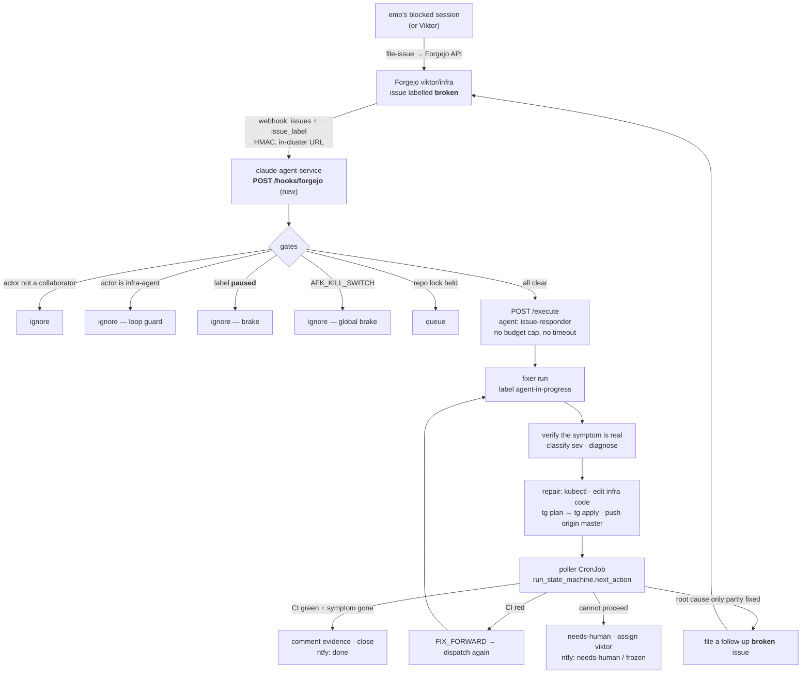

# The fixer — a `broken` issue on Forgejo repairs itself

**Status:** built and live, 2026-08-25 · **Date:** 2026-08-25 · **Repo:**
`claude-agent-service` (control plane) + `infra` (labels, webhook, agent
definition) · **Owner:** Viktor (wizard) · **Flow:** grill-with-docs

> Provenance: the output of a grilling session on 2026-08-25. It records the
> decisions and the evidence each one rests on, including the alternatives that
> were considered and set aside.

## Problem

emo (Emil, OS user `emo`, tier `power-user`) works on this box daily and reaches
walls he cannot pass on his own. Today those walls end at Viktor: emo writes up
what he found, and the work waits until Viktor is available.

The shape of the wall is narrow, and the evidence is specific. Across emo's 126
Claude transcripts, every access denial is **cluster-side**:

| Denial | Namespaces |
|---|---|
| `get`/`list` `secrets`, `externalsecrets` | tuya-bridge, changedetection, wireguard, openclaw, immich |
| `create pods` (debug/exec), `pods/exec`, `pods/portforward` | tuya-bridge, freedify |
| `delete pods` (stuck pod) | immich |
| `get middlewares`, `list resourcequotas` | traefik, immich |

`Error from server (Forbidden)` appears 50 times. Two absences are informative:
no `protected branch` or `pre-receive hook declined` (git is
already unblocked — `ebarzin` is on the master push+merge whitelist), and the 8
`sudo: a password is required` hits are all on the Synology as
`uid=1027(Administrator)`, not on the devvm. Nothing in a month of his work
needed root on this box.

Where his reports land is the other half of the problem. Forgejo `viktor/infra`
holds 29 issues — 18 by `viktor`, **11 by `ebarzin`**, three of them filed on
2026-08-24. GitHub `ViktorBarzin/infra` holds 85 issues, **100% authored by
`ViktorBarzin`**. The automation — `.github/workflows/issue-automation.yml` →
Woodpecker → `claude-agent-service` → the `issue-responder` agent — fires only on
GitHub. So reports arrive in the tracker with no automation, and the automation
watches the tracker only one person uses.

His issues are also not outages. #27 *"frigate: move off the 0.17.0 beta onto
0.17.2"*, #28 *"docs: runbook for Vault failing closed on a full audit volume"*
("Emil ran into this from a non-admin workstation session"), #29
*"server_safe_poweroff: prune the Task Scheduler run output"*. They are
researched change proposals he cannot land himself.

## Goal

A `broken` issue on Forgejo `viktor/infra` gets diagnosed and repaired
autonomously — including editing code and pushing to `master` — so emo is
unblocked while Viktor is away, and Viktor reads what happened afterwards.

Deliberately not in scope: giving emo a session as `wizard`. That path was
considered and set aside, because `wizard` holds `(ALL:ALL) NOPASSWD: ALL` — a
shell as `wizard` is devvm root, the git-crypt master key, `infra/secrets/`
plaintext, `secret/viktor`, a cluster-admin kubeconfig, and a Vaultwarden with
305 personal logins. The fixer needs none of that, and `claude-agent-service`
already holds precisely the cluster capability the evidence calls for.

## What already exists

Most of this design is wiring rather than new machinery, and the pieces were
built with care by earlier work. Naming what each one already does:

| Piece | State today |
|---|---|
| `claude-agent-exec` ClusterRole | Cluster-wide CRUD on pods, `pods/exec`, **secrets**, configmaps, services, PVCs, namespaces, events + apps/batch/networking + rbac roles/rolebindings. Its own comment: *"close to cluster-admin in blast radius"*. Every denial above sits inside it. |
| `.claude/agents/issue-responder.md` | *"investigates, resolves if confident, escalates if complex"* — incident playbook (verify real → classify sev → restart/scale/fix TF → `tg plan` → `tg apply`) and feature playbook, with a written safety envelope, comment formats and a commit convention. |
| `app/afk/run_state_machine.py` | `pushed + green → CLOSE_SUCCESS`; `pushed + red + budget → FIX_FORWARD`; budget out → `FREEZE_ESCALATE`; nothing pushed + thread dead → `ESCALATE_PREPUSH`. A pure function over a decision table. |
| `app/afk/ci_watcher.py` | Folds GHA build → Woodpecker deploy → Keel rollout into one `PENDING`/`GREEN`/`RED` verdict, clients injected behind Protocols. |
| `app/afk/dispatch_policy.py` | Trust gate → allowlist → **per-repo lock** → `blocked_by` → priority. At most one decision per repo. No IO. |
| `app/afk/tracker.py` | Read/write port onto the tracker behind an injected client. Its decisions are forge-agnostic; `labeled_by_trusted` is fail-closed from the actor of the most recent label application. |
| `app/afk/notifier.py` | Terminal-state doorbell (`done` / `needs-human` / `frozen`), pure render + injected sender. |
| Forgejo mailer | `FORGEJO__mailer__ENABLED`, smtp+starttls — issue comments already email the author. |
| `ntfy` stack | Self-hosted; the natural sender for the doorbell. |

The AFK loop landed on `master` (`e34640c`) on 2026-06-15 with 412 tests and
ships disabled — `kill_switch=True` plus an empty allowlist, and arming needs
both. Its executor, the `t3-afk` T3 instance, was scaled to 0/0 the same day
("no current plans to use the autonomous AFK pipeline") with its PVC, Service,
Ingress and ExternalSecret preserved. This design does not revive it.

## The design

One trigger, one tracker, one agent at a time.

### Trigger and authorization

A Forgejo webhook of type `forgejo` on `viktor/infra`, subscribed to the
`issues` and `issue_label` events, posting to the cluster-internal service URL.
The repo already demonstrates this pattern: its only existing hook posts to
`http://woodpecker-server.woodpecker.svc.cluster.local/api/hook?access_token=…`
on `push`.

Authorization is the label, on a private repo where only collaborators can
apply one. Forgejo `viktor/infra` has exactly one collaborator, `ebarzin`, plus
the owner `viktor` — which is the intended set. `tracker.labeled_by_trusted`
already implements this rule fail-closed: the actor of the most recent
application of the gating label decides, and an unattributable label is never
trusted.

Two forced choices worth recording. **Forgejo Actions** is enabled on the repo
but no runner exists anywhere in the cluster, and standing one up is in-cluster
CI compute, which infra ADR-0002 rules out. **Woodpecker** cannot be the
receiver either: its hook endpoint understands push/PR/tag, not issue events, so
it would need a translator regardless. A webhook into the service that
ultimately runs the agent reaches the same dispatch with one hop fewer.

### Why Forgejo rather than GitHub

Beyond "it is where the reports already are": `origin` in the infra clone **is**
Forgejo (both remotes point there; there is no GitHub remote). So the
responder's `git push origin master` and its `fixes #N` convention already
resolve against Forgejo issue numbers, while the issue it was dispatched for is
a GitHub issue with an unrelated number. On Forgejo the tracker and the commit
convention refer to the same issue.

### Execution model

One-shot `/execute` jobs, the path the responder uses today. No T3 revival, no
session state to keep alive. Continuity is expressed in the tracker instead:

- Each run either **fixes the whole root cause**, or **files a follow-up
  `broken` issue** that triggers the next run. The issue graph is the work
  queue.
- The agent's comment carries a machine-readable footer — job id, pushed sha,
  attempt count, chain parent — so a cold-started successor knows what its
  predecessor did. No new datastore; the tracker is the memory, and the trail
  stays human-readable.
- Before closing, the run **re-checks the original symptom**, not only that CI
  went green. A green deploy that did not fix the reported thing counts as
  further work, so it fix-forwards rather than closing.

Burn rate is bounded by serialization rather than by caps. `dispatch_policy`'s
per-repo lock means at most one fixer runs at a time; `infra` is the only
enrolled repo, so a second `broken` issue queues behind the first. There is no
dollar billing to bound — the agent authenticates with `CLAUDE_CODE_OAUTH_TOKEN`,
a subscription credential, so `--max-budget-usd` is a notional ceiling the CLI
computes rather than a bill. The cost of an unbounded run is rate-limit
headroom, shared with Viktor's own sessions.

### Vocabulary

Two labels a human (or a human's agent) applies, and a set the fixer maintains.
The names are load-bearing: a model has to tag correctly from the name alone, so
they describe the observed state rather than the reporter or the wish.

| Label | Meaning | Effect |
|---|---|---|
| `broken` | Something is not working right now | **Dispatches the fixer** |
| `change` | A proposal; nothing is failing | Filed only; no dispatch |
| `agent-in-progress` | A fixer run holds this issue | Poller input; visible state |
| `paused` | Human brake on this one issue | Skipped by poller and dispatch |
| `needs-human` | Escalated | Assigned to `viktor`, doorbell fired |
| `incident`, `sev1`/`sev2`/`sev3`, `postmortem-required` | Applied by the fixer during triage | Drives the post-mortem pipeline for sev1/sev2 |

This vocabulary has to reach the agents that apply it, or the trigger misfires:
both users' `file-issue` skills, the `issue-responder` definition, and
`CONTEXT.md`'s glossary.

## Built and live — 2026-08-25

Everything below shipped the same day it was designed. The chain was verified
end to end with a deliberate probe filed as `emo`
([`viktor/infra#30`](https://forgejo.viktorbarzin.me/viktor/infra/issues/30)):
the webhook dispatched, the run read the issue, ran the "verify it is actually
broken" step, concluded correctly that nothing was broken, reported its
evidence, relabelled the issue `change`, closed it, and changed nothing in the
cluster.

What went in:

| Piece | Where |
|---|---|
| `POST /hooks/forgejo` + the pure admission gates | `app/fixer/{receiver,gates,signature}.py` |
| Forgejo adapter satisfying the existing tracker port | `app/fixer/forgejo.py` |
| Run state as a hidden footer on the run's own comment | `app/fixer/runstate.py` |
| One-shot `/execute` behind the loop's T3-shaped ports | `app/fixer/execute_client.py` |
| CI verdict (Woodpecker decisive, GHA stage optional) | `app/fixer/ci.py` |
| The tick: drain the queue, drive in-flight runs | `app/fixer/tick.py` |
| Doorbell over ntfy, write-only to one topic | `app/fixer/ntfy.py` |
| Unbounded budget/timeout; `start_job` shared with `/execute` | `app/main.py` |
| Responder rewritten for Forgejo, platform stacks in scope | `infra/.claude/agents/issue-responder.md` |
| Bot identity, both secrets, env, `fixer-tick` CronJob | `infra/stacks/claude-agent-service/main.tf` |
| `file-issue` on Forgejo with each caller's own PAT | vendored + both users' skill dirs |
| The fixer section in emo's `CLAUDE.md` | `/home/emo/.claude/CLAUDE.md` |

Out-of-band identities created (not Terraform-managed, recorded here):
`infra-agent` on Forgejo (write:repository + write:issue, collaborator on
`viktor/infra`), a write-only `fixer` ntfy user scoped to the `fixer` topic, the
ten labels, and the repo webhook. emo's own Forgejo PAT was reminted with
`write:issue` added — his previous one was repository-scoped only, so the
filing path would have 403'd for him.

The 23 open GitHub issues were migrated to Forgejo with backlinks and closed on
GitHub; `ViktorBarzin/infra` now has no open issues. Everything moved as
`change` except the one `user-report`, which is `broken`.

### What live running found that the design did not

Five defects surfaced only by running the real thing, which is worth recording
because each was invisible to the tests:

1. **The fix-forward budget contradicted the no-caps decision.** The loop's
   shipped bounds (5 attempts / 3600s) are compared strictly, so every run older
   than an hour would have frozen instead of correcting. The fixer now loads an
   unbounded default and leaves the pure state machine's contract alone.
2. **The agent is resolved by name, not by path.** `--agent
   .claude/agents/issue-responder` fails with "not found" while listing
   `issue-responder` as available. The path form came from the retired Woodpecker
   pipeline.
3. **Inferring the pushed commit from prose does not work, and was removed.**
   Job ids are 12 hex characters and every run prints its own; excluding those
   was still not enough — a live run that correctly changed *nothing* was
   recorded as having pushed because its report named the running image tag
   (`b0ef3eca`). Each false positive left the state machine waiting on CI for a
   commit that did not exist. A run now **declares** its commit on its own line
   (`Pushed-Commit: <sha>`) and nothing else is read as one. An undeclared push
   reads as not-pushed and escalates to a human — a missing marker costs one
   notification, a phantom commit costs a stuck run.
4. **The doorbell needed authentication.** ntfy here is
   `NTFY_AUTH_DEFAULT_ACCESS=deny-all`, so the first real escalation relabelled
   the issue correctly and then failed to tell anyone (403).
5. **The progress checklist described the wrong work.** Inherited from the AFK
   loop, it claimed "Failing test written (TDD red)" on an incident fix, on an
   issue a person reads. The fixer now passes phases that describe a repair.

Two smaller ones: the tick CronJob needed `working_dir = /srv`, where the image
bakes the app; and a run that closes its own issue must drop the
`agent-in-progress` label, which a closed issue no longer needs but a reader
still sees.

### Still open

- **The GitHub Actions build stage is unobserved** unless `FIXER_GITHUB_TOKEN`
  is set. Woodpecker's apply is the decisive stage for infra, so verdicts rest
  on it; the log says so on every tick rather than leaving it implicit.
- **A webhook delivery during a pod roll is lost.** Observed during this build:
  Forgejo delivered while Keel was rolling the deployment, so the issue sat
  until the next tick drained it. That is the drain working as designed, at up
  to two minutes of latency.
- **Chain depth and rate caps are gone**, replaced by the per-repo lock. Nothing
  yet exercises a long fix-forward chain, so the convergence behaviour is
  reasoned about rather than observed.

## Decisions

| # | Decision | Choice | Rationale |
|---|---|---|---|
| 1 | What blocks emo | Admin capability only | The transcript evidence is 100% cluster-side |
| 2 | Mechanism | A fixer agent, not a session as Viktor | The needed capability already exists in-cluster; a `wizard` shell would grant far more |
| 3 | Capability envelope | Full `claude-agent-exec` | No new policy layer to build; the agent's own instructions are the policy |
| 4 | Tracker | **Forgejo only** — GitHub automation retired | Reports already land there; `origin` and `fixes #N` agree there |
| 5 | Trigger | The `broken` label | Only broken things wake the fixer |
| 6 | Label model | Router: `broken` → incident path, `change` → filed only | Viktor's own notes stay notes |
| 7 | Vocabulary | `broken` / `change` + the fixer's own set | Tagged correctly from the name alone |
| 8 | Agent identity | Dedicated Forgejo bot `infra-agent` | Clean attribution; makes the loop guard a one-line author check |
| 9 | Platform stacks | The `never modify vault/dbaas/traefik/authentik/kyverno` rule is **dropped** | A platform outage is when Viktor's absence hurts most |
| 10 | Repo scope | `infra` only | The repo with the warm clone and the CI/CD chain; app-code bugs escalate |
| 11 | After push | Watch until green, **fix forward** | `run_state_machine` already implements exactly this |
| 12 | Executor | One-shot `/execute` jobs | No T3 rig to revive or maintain |
| 13 | Continuation | Whole root cause, or a follow-up issue that self-triggers | Tracker as queue; no session state |
| 14 | Throttle | **No caps**; serialized by the per-repo lock | One fixer at a time pins burn rate without truncating any single fix |
| 15 | Reach | Cluster + infra repo; out-of-cluster escalates | Keeps autonomous mutation inside the declarative, revertible surface |
| 16 | Brake | `paused` label (instant) + `AFK_KILL_SWITCH` (global) | Two speeds; neither cancels a job already in flight |
| 17 | Who files | emo's Claude files `broken` autonomously | The blocked session holds the context and no human relay is available |
| 18 | GitHub backlog | Migrate the 23 open issues to Forgejo | One backlog in one place; #71 becomes a `broken` issue the fixer can take |

## Safety posture

What bounds this:

- **Serialization.** One fixer at a time, `infra` only. A runaway consumes one
  job's worth of headroom at a time, not a fleet's.
- **The agent's own instructions.** `issue-responder.md`'s envelope stays as
  written except for the platform-stack rule: never delete PVCs/PVs or user
  data, never modify Vault secrets directly, never force-push or reset, always
  `tg plan` before `tg apply`, escalate when a plan shows destroys, all changes
  through Terraform. These are prompt-level, not enforced — they are guidance the
  agent follows, not a boundary it cannot cross.
- **Recoverability.** Git remotes and backups, the same posture the rest of this
  box relies on for emo (2026-07-07: safety rests on backups and ACLs at the
  OS/infra layer, not on Claude primitives).
- **Terraform state locking** prevents a concurrent `tg apply` between the fixer
  and a human. A `presence` claim was considered and dropped: the agent image
  carries no `pymysql` or `homelab` CLI, and state locking already covers the
  collision that matters.
- **Attribution.** Every action lands as an `infra-agent` comment, label, or
  commit, with the reporter and the chain parent recorded in the issue.

### Risks accepted

- **Reporting path.** Dropping the platform-stack
  exclusion means a bad Vault, traefik, or authentik change can remove the
  agent's ability to tell anyone what it did. Mitigated by ordering — on those
  five stacks it captures findings and comments them **before** mutating, the
  same rule breakglass's `forensics` step encodes — but not eliminated.
- **The brake.** Both stops prevent the next
  dispatch; neither cancels one mid-flight. `kubectl scale` remains the only hard
  stop and takes the other consumers of `claude-agent-service` with it.
- **Coverage.** Roughly five of his eleven issues are
  `broken`; the rest are `change`, and app-code bugs (#23, the tuya-bridge
  gunicorn hang) are out of repo scope. This makes the urgent half self-service,
  not all of it. The trigger can widen later without redesign.
- **Chained triggers.** emo's Claude files `broken` autonomously, and a
  fixer can file a follow-up `broken`. The per-repo lock and the `paused` label
  are what stand between that and a chain nobody asked for.

## What gets built, reused, retired

**Reused unchanged:** `run_state_machine`, `ci_watcher`, `dispatch_policy` (per-repo
lock, trust gate), `notifier`, `tracker`'s forge-agnostic decisions,
`claude-agent-exec` RBAC, Forgejo's mailer, the `ntfy` stack.

**Retired:** `.github/workflows/issue-automation.yml`,
`.woodpecker/issue-automation.yml` (its only trigger was that workflow), and the
responder's dependency on `secret/viktor`.

**Built:**

1. `POST /hooks/forgejo` — signature validation, the five gates, dispatch.
2. `ForgejoClient` implementing `tracker.py`'s existing client port. The image
   carries no `gh` and no HTTP library beyond the stdlib (requirements are
   `fastapi` + `uvicorn`), so this is plain HTTP over `urllib` or a new `httpx`
   dependency.
3. `issue-responder.md` rewritten against the Forgejo API, using the
   `infra-agent` PAT and dropping the platform-stack exclusion.
4. Unbounded budget/timeout: `--max-budget-usd` is currently always appended and
   `timeout_seconds` defaults to 2700 via `asyncio.wait_for`. Both become
   optional (omit the flag; `timeout=None`).
5. The poller CronJob (`app/afk/poller.py`, never deployed) driving
   `next_action` over issues labelled `agent-in-progress`.
6. `file-issue` rewritten for Forgejo in **both** users' skill directories —
   emo's copy currently reads `secret/viktor` and is a no-op in his account —
   using each user's own Forgejo PAT from `~/.git-credentials` and setting the
   new labels.
7. The `infra-agent` Forgejo account and its PAT in Vault. Forgejo users are not
   Terraform-managed (the stack has no Forgejo provider), so this is an
   out-of-band identity, recorded here.
8. The label set created on `viktor/infra`, which has no labels at all today.
9. A one-off migration of the 23 open GitHub issues, with backlinks, closing the
   GitHub originals.
10. Config retarget: `ready_label` → `broken`, allowlist → `[infra]`,
    `AFK_KILL_SWITCH=false`, an ntfy sender wired into the notifier.

Items 1, 2 and 4 carry testable behaviour and are built test-first, matching the
existing `app/afk` suite's style (pure decisions, injected ports, fakes).

## Open questions

Things this design asserts less firmly than the rest, to confirm during the
build rather than assume:

- **The exact webhook contract.** Forgejo is 11.0.14 (gitea-1.22.0 API) and hook
  events are a free-form string array in the API schema. `issues` and
  `issue_label` are the expected names and the signature header is expected to be
  `X-Forgejo-Signature` (with `X-Gitea-Signature` as a compatibility alias), but
  both should be confirmed against a live delivery before the gates are written
  against them.
- **Which payload `action` values carry a label change** — `label_updated`
  versus a separate `issue_label` delivery — decides whether one handler or two
  is right.
- **Whether the poller needs its own liveness signal.** With one-shot jobs there
  is no T3 thread status, so `RunState.thread_status` maps onto `/jobs/{job_id}`.
  A job that dies with the pod leaves an `agent-in-progress` label with nothing
  behind it; the poller needs a way to notice that and re-dispatch or escalate.
- **Post-mortem pipeline on Forgejo.** It is kept for sev1/sev2, and its agents
  write to `docs/post-mortems/`. Whether anything in that pipeline is
  GitHub-coupled has not been checked.
